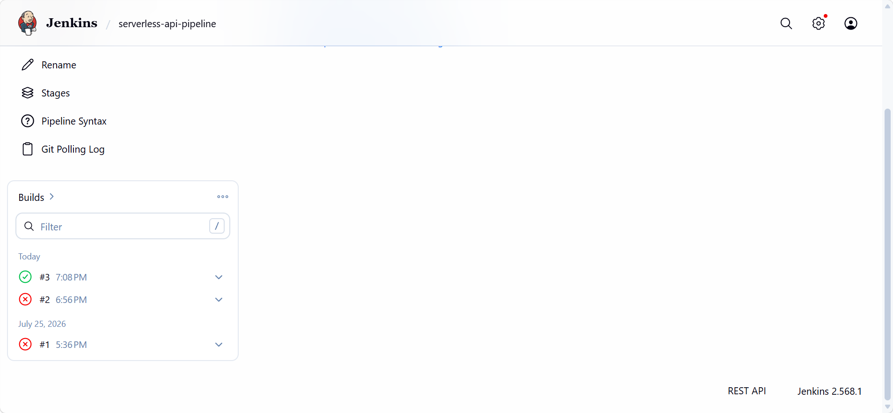

# Serverless REST API

A full CRUD REST API built with AWS Lambda, API Gateway, and DynamoDB — tested locally via LocalStack, callable with plain curl/HTTP requests just like a production API.

## What it does

A simple "notes" API supporting Create, Read, Update, and Delete operations, backed by a NoSQL database (DynamoDB) and exposed through a real HTTP REST interface (API Gateway).

## Architecture
- **API Gateway**: routes HTTP requests to Lambda
  - `POST /notes` — create a note
  - `GET /notes/{id}` — read a note
  - `PUT /notes/{id}` — update a note
  - `DELETE /notes/{id}` — delete a note
- **Lambda** (`lambda_function.py`): routes each HTTP method to the matching CRUD operation
- **DynamoDB**: stores notes, keyed by a generated UUID
- **IAM Role**: scoped to the specific DynamoDB table

## Endpoints (CRUD to HTTP mapping)

| Operation | HTTP Method | Path |
|---|---|---|
| Create | POST | /notes |
| Read | GET | /notes/{id} |
| Update | PUT | /notes/{id} |
| Delete | DELETE | /notes/{id} |

## Example usage

```bash
curl -X POST http://localhost:4566/restapis/{api-id}/dev/_user_request_/notes \
  -H "Content-Type: application/json" \
  -d '{"content": "My first note"}'

curl http://localhost:4566/restapis/{api-id}/dev/_user_request_/notes/{id}

curl -X PUT http://localhost:4566/restapis/{api-id}/dev/_user_request_/notes/{id} \
  -H "Content-Type: application/json" \
  -d '{"content": "Updated content"}'

curl -X DELETE http://localhost:4566/restapis/{api-id}/dev/_user_request_/notes/{id}
```

## A real bug I hit and fixed

The Lambda function initially couldn't connect to DynamoDB — it kept timing out with EndpointConnectionError, because I'd hardcoded the wrong hostname for LocalStack's internal networking. Fixed it by using LocalStack's built-in LOCALSTACK_HOSTNAME environment variable, which is automatically injected into every Lambda execution environment:

```python
localstack_host = os.environ.get('LOCALSTACK_HOSTNAME', 'localhost')
dynamodb = boto3.resource('dynamodb', endpoint_url=f'http://{localstack_host}:4566', region_name='us-east-1')
```

## Tech stack
- Python 3.12 (boto3)
- AWS Lambda, API Gateway, DynamoDB, IAM
- LocalStack (local AWS emulation)
- Jenkins (CI pipeline)

## CI/CD
Jenkins pipeline (Jenkinsfile) runs on every push: syntax check, module load test, and packaging.
## Screenshots


